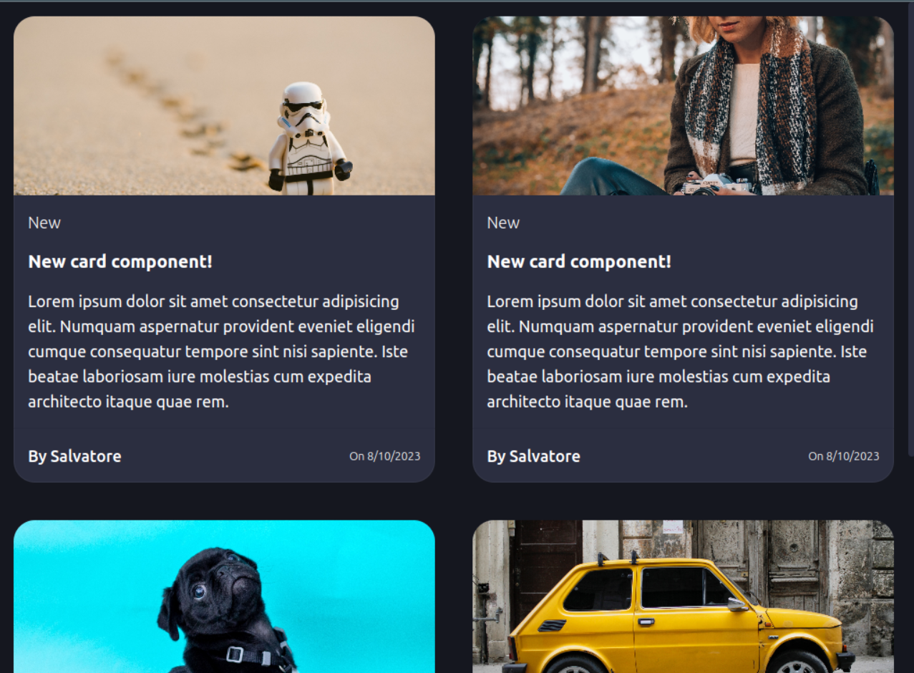

# Sveltekit ui-kit

Reusable and responsive ui-kit components for your next SvelteKit project. 

## Components

1. **Card**: go to /card to see a demo 


## Building
Once you've created a project and installed dependencies with `npm install` (or `pnpm install` or `yarn`), start a development server:
```

## Developing
npm run dev

# or start the server and open the app in a new browser tab
npm run dev -- --open
```

To create a production version of the lib:

```bash
npm run build
```

You can preview the production build with `npm run preview`.